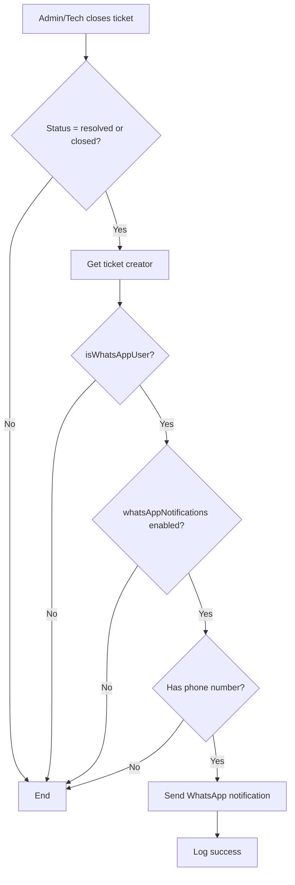

# WhatsApp User Separation & Notifications

## 🎯 Overview

The system now separates WhatsApp users from regular users and automatically sends WhatsApp notifications when tickets are resolved or closed.

---

## ✨ New Features

### 1. **User Type Identification**

**Two new fields added to User model:**
- `isWhatsAppUser` (Boolean) - Identifies users created via WhatsApp
- `whatsAppNotifications` (Boolean) - Enable/disable WhatsApp notifications

**How it works:**
- Users created via WhatsApp bot are automatically marked as `isWhatsAppUser = true`
- Regular users (signup, admin-created) have `isWhatsAppUser = false`
- WhatsApp notifications are enabled by default for WhatsApp users

### 2. **Automatic WhatsApp Notifications**

When a ticket status changes to **"resolved"** or **"closed"**, the system:
1. Checks if the ticket creator is a WhatsApp user
2. Verifies they have notifications enabled
3. Sends a formatted WhatsApp message with ticket details

**Notification includes:**
- Ticket number and title
- New status (RESOLVED/CLOSED)
- Resolution details (if provided)
- Link to view ticket online
- Option to return to menu

---

## 📊 API Changes

### Get Users with Filtering

**Endpoint:** `GET /api/users`

**New Query Parameters:**
- `?type=whatsapp` - Returns only WhatsApp users
- `?type=regular` - Returns only regular (non-WhatsApp) users
- No parameter - Returns all users

**Examples:**
```bash
# Get all WhatsApp users
GET /api/users?type=whatsapp

# Get all regular users
GET /api/users?type=regular

# Get all users
GET /api/users
```

**Response includes:**
```json
{
  "id": "...",
  "email": "...",
  "name": "...",
  "role": "USER",
  "phone": "+27606344230",
  "isWhatsAppUser": true,
  "whatsAppNotifications": true,
  "createdAt": "2025-11-18T..."
}
```

---

## 🔔 Notification Flow

### When Ticket is Closed/Resolved:



### WhatsApp Notification Format:

**For Resolved Tickets:**
```
✅ *Ticket RESOLVED*

📋 Ticket #TKT-00042
📌 Title: My printer is not working
📊 Status: RESOLVED

📝 Resolution: Printer cable was reconnected and tested successfully.

Your issue has been resolved! If you have any concerns, you can reopen this ticket.

🔗 View details: http://localhost:5173/tickets

Type *MENU* for more options.
```

**For Closed Tickets:**
```
🔒 *Ticket CLOSED*

📋 Ticket #TKT-00042
📌 Title: My printer is not working
📊 Status: CLOSED

Your ticket has been closed. Thank you for using our support service!

🔗 View details: http://localhost:5173/tickets

Type *MENU* for more options.
```

---

## 🧪 Testing

### Test User Creation

1. **Create WhatsApp User:**
```bash
# Send "Hi" to WhatsApp Business number
# User will be auto-created with isWhatsAppUser = true
```

2. **Check User in Database:**
```bash
node checkUsers.mjs

# Look for:
# isWhatsAppUser: true
# whatsAppNotifications: true
```

### Test Notification System

1. **Create a ticket via WhatsApp:**
```
Send "Hi" → Select "1" → Describe issue
```

2. **Admin closes the ticket:**
```
# In dashboard:
- Open the ticket
- Change status to "Resolved" or "Closed"
- Add resolution (optional)
- Save
```

3. **Check WhatsApp:**
```
# User should receive notification within 1-2 seconds
# Check server logs for:
# "📱 Sending WhatsApp notification for ticket..."
# "✅ WhatsApp notification sent..."
```

---

## 📋 Database Changes

### New Fields in User Table:

```prisma
model User {
  // ... existing fields ...

  // WhatsApp Integration
  isWhatsAppUser        Boolean  @default(false)
  whatsAppNotifications Boolean  @default(true)

  // ... rest of model ...
}
```

**Migration Applied:**
- ✅ Fields added to database
- ✅ Existing users default to `isWhatsAppUser = false`
- ✅ New WhatsApp users automatically set to `true`

---

## 🎯 Use Cases

### 1. Filter WhatsApp Customers

**In Admin Dashboard:**
```javascript
// Get only WhatsApp users
const whatsappUsers = await fetch('/api/users?type=whatsapp');

// Display separately in UI
// - Show "Created via WhatsApp" badge
// - Show WhatsApp icon
// - Group in separate section
```

### 2. Disable Notifications for Specific User

```javascript
// Update user preferences
await prisma.user.update({
  where: { id: userId },
  data: { whatsAppNotifications: false }
});

// User will no longer receive WhatsApp notifications
// But can still use the bot
```

### 3. Send Manual Notification

```typescript
import { whatsappService } from './lib/whatsapp';

// Send custom notification to WhatsApp user
await whatsappService.sendTextMessage({
  to: user.phone,
  message: 'Your custom message here...'
});
```

---

## 🔍 Identifying WhatsApp Users

### In Frontend:

**User List Display:**
```tsx
{user.isWhatsAppUser && (
  <Badge variant="success">
    <WhatsAppIcon /> WhatsApp User
  </Badge>
)}
```

**Filter Options:**
```tsx
<Select>
  <option value="all">All Users</option>
  <option value="whatsapp">WhatsApp Users</option>
  <option value="regular">Regular Users</option>
</Select>
```

### In Backend:

**Query Examples:**
```typescript
// Get all WhatsApp users
const whatsappUsers = await prisma.user.findMany({
  where: { isWhatsAppUser: true }
});

// Get regular users only
const regularUsers = await prisma.user.findMany({
  where: { isWhatsAppUser: false }
});

// Count by type
const counts = await prisma.user.groupBy({
  by: ['isWhatsAppUser'],
  _count: true
});
```

---

## 🛡️ Privacy & Control

### User Preferences:

Users can control their notification settings:
- `whatsAppNotifications = true` → Receive notifications
- `whatsAppNotifications = false` → No notifications (but bot still works)

### When Notifications are Sent:

✅ **Will send:**
- Ticket resolved
- Ticket closed
- User has WhatsApp enabled
- User has valid phone number

❌ **Won't send:**
- Status changed to "in_progress" or "open"
- User disabled WhatsApp notifications
- User has no phone number
- User is not a WhatsApp user

---

## 📊 Statistics You Can Track

```typescript
// WhatsApp users statistics
const stats = {
  totalWhatsAppUsers: await prisma.user.count({
    where: { isWhatsAppUser: true }
  }),

  whatsappTickets: await prisma.ticket.count({
    where: {
      createdBy: {
        isWhatsAppUser: true
      }
    }
  }),

  notificationsEnabled: await prisma.user.count({
    where: {
      isWhatsAppUser: true,
      whatsAppNotifications: true
    }
  })
};
```

---

## 🚀 Benefits

### For Customers:
✅ Get instant notifications when tickets are resolved
✅ No need to check dashboard constantly
✅ Receive updates via their preferred channel (WhatsApp)
✅ Easy to reply with "MENU" for more options

### For Support Team:
✅ Identify which users came from WhatsApp
✅ Filter and manage WhatsApp customers separately
✅ Track WhatsApp channel effectiveness
✅ Reduce support load with automated updates

### For Business:
✅ Better customer satisfaction
✅ Faster communication
✅ Channel attribution tracking
✅ Improved response time metrics

---

## 🔧 Configuration

### Environment Variables:

```bash
# Required for WhatsApp notifications
WHATSAPP_PHONE_NUMBER_ID="..."
WHATSAPP_ACCESS_TOKEN="..."
CLIENT_URL="http://localhost:5173"  # Used in notification links
```

### Feature Toggle:

To temporarily disable WhatsApp notifications without changing user settings:

```typescript
// In tickets.ts, comment out the WhatsApp notification block
// Or add a feature flag:
const WHATSAPP_NOTIFICATIONS_ENABLED = process.env.ENABLE_WHATSAPP_NOTIFICATIONS === 'true';

if (WHATSAPP_NOTIFICATIONS_ENABLED && creator.isWhatsAppUser) {
  // Send notification
}
```

---

## 📝 Summary

### What Changed:

1. ✅ Added `isWhatsAppUser` and `whatsAppNotifications` fields
2. ✅ Auto-mark users created via WhatsApp
3. ✅ Send WhatsApp notifications on ticket close/resolve
4. ✅ API endpoint filtering by user type
5. ✅ Comprehensive notification system

### What's Next:

You can now:
- Distinguish WhatsApp users from regular users
- Filter user lists by type
- Send automatic notifications on ticket resolution
- Track WhatsApp channel effectiveness
- Manage user notification preferences

---

## 🎉 You're All Set!

Your system now:
- ✅ Separates WhatsApp users from regular users
- ✅ Sends automatic notifications when tickets are resolved/closed
- ✅ Gives users control over their notification preferences
- ✅ Provides filtering and reporting capabilities

**Test it now:**
1. Create a ticket via WhatsApp
2. Close it from the dashboard
3. Watch the WhatsApp notification arrive instantly!

🎊 **Customer satisfaction improved!**
